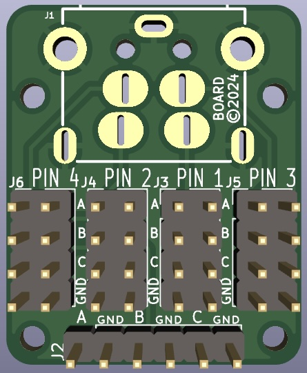
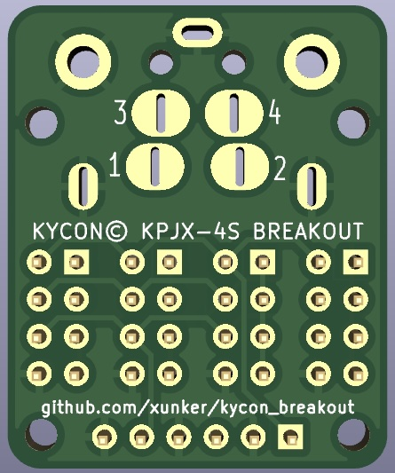

Kycon© KPJX-4S Connector Breakout
=================================

[Schematic](images/kjs-4s_breakout.pdf)

Mounting holes are M2.2.

## Configuration Jumpers

Use Jumper Blocks J3-J6 to map the pins from the Kycon connector to the outgoing header J2.

For example, to make Kycon pin 1 connect to J2 output pin A, pin 2 to output pin
B, pin 3 to output C, and pin 4 to GND:

Block            | Row        | State
-----------------|------------|------
J3 (Kycon pin 1) |            |
_                | 1-2 (A)    | Closed (Jumpered)
_                | 3-4 (B)    | open
_                | 5-6 (C)    | open
_                | 7-8 (GND)  | open
J4 (Kycon pin 2) |            |
_                | 1-2 (A)    | open
_                | 3-4 (B)    | Closed (Jumpered)
_                | 5-6 (C)    | open
_                | 7-8 (GND)  | open
J5 (Kycon pin 3) |            |
_                | 1-2 (A)    | open
_                | 3-4 (B)    | open
_                | 5-6 (C)    | Closed (Jumpered)
_                | 7-8 (GND)  | open
J6 (Kycon pin 4) |            |
_                | 1-2 (A)    | open
_                | 3-4 (B)    | open
_                | 5-6 (C)    | open
_                | 7-8 (GND)  | Closed (Jumpered)

Multiple Kycon pins can be connected to the same output, as long as they are the
same voltage. For example, If power coming in to the Kycon connector as +12V on
pins 1 and 3, and ground on pins 2 and 4, I could configure J3-J6 as:

Block            | Row        | State
-----------------|------------|------
J3 (Kycon pin 1) |            |
_                | 1-2 (A)    | Closed (Jumpered)
_                | 3-4 (B)    | open
_                | 5-6 (C)    | open
_                | 7-8 (GND)  | open
J4 (Kycon pin 2) |            |
_                | 1-2 (A)    | open
_                | 3-4 (B)    | open
_                | 5-6 (C)    | open
_                | 7-8 (GND)  | Closed (Jumpered)
J5 (Kycon pin 3) |            |
_                | 1-2 (A)    | Closed (Jumpered)
_                | 3-4 (B)    | open
_                | 5-6 (C)    | open
_                | 7-8 (GND)  | open
J6 (Kycon pin 4) |            |
_                | 1-2 (A)    | open
_                | 3-4 (B)    | open
_                | 5-6 (C)    | open
_                | 7-8 (GND)  | Closed (Jumpered)

This would combine both +12V pins to a single output (A) and both GND pins to
ground. In this configuration, output pins B and C are not connected.

### Credit

[Footprint for KPJX-4S](https://github.com/prusa3d/Buddy-board-MINI-PCB/blob/master/rev.1.0.0/.pretty/KPJX-4S.kicad_mod) connector is from [Prusa3D's Buddy Board Mini PCB](https://github.com/prusa3d/Buddy-board-MINI-PCB/tree/master).